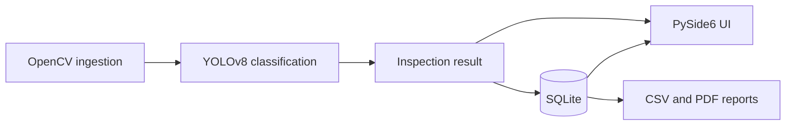

# Industrial Vision Inspector

Industrial Vision Inspector is a desktop quality-control project for classifying top-view casting images as defective or acceptable. The target dataset contains submersible pump impeller images captured from one product type and camera angle. The project currently includes reproducible data preparation, OpenCV ingestion, a YOLOv8 classification wrapper, training, and held-out evaluation. Storage, the desktop UI, and reporting will be added in later verified phases.

Manual visual inspection can vary between operators and across a long shift. A small classification model can provide a consistent first-pass decision and preserve each result for review. This project is intentionally a demonstrator, not a claim of production-line readiness.

## Detection decision

The project uses a **classification-first** pipeline because the Kaggle dataset provides image-level `defective` and `ok_front` labels, not defect bounding boxes. YOLOv8 classification is faster and more reliable to train on modest hardware than a detector trained on noisy pseudo-boxes. Defective images will receive approximate OpenCV contour highlights for visual feedback; those highlights are not learned localization ground truth.

## Architecture



The ingestion, classification, training, and evaluation components now exist. Datasets and trained weights are generated locally and intentionally excluded from Git; the compact evaluation metrics and confusion matrix are versioned for reproducibility.

## Phase 1 setup

Use Python 3.11 or 3.12. From the repository root:

```bash
python -m venv .venv
source .venv/bin/activate
python -m pip install numpy opencv-python pytest kaggle ultralytics matplotlib
```

Dependency versions will be pinned during Phase 6, after the complete runtime dependency set is known. Ultralytics installs PyTorch as a dependency. On a CPU-only Linux machine, install the smaller CPU wheels first to avoid downloading unused CUDA libraries:

```bash
python -m pip install --index-url https://download.pytorch.org/whl/cpu torch torchvision
python -m pip install ultralytics
```

### Kaggle credentials and dataset

1. Sign in to Kaggle and open **Settings**.
2. Under **API**, select **Create New Token** to download `kaggle.json`.
3. Move it to the Kaggle CLI location and restrict its permissions:

   ```bash
   mkdir -p ~/.kaggle
   mv /path/to/kaggle.json ~/.kaggle/kaggle.json
   chmod 600 ~/.kaggle/kaggle.json
   ```

4. Download, cache, and prepare the dataset:

   ```bash
   python scripts/download_dataset.py
   ```

The archive is cached under `data/cache/`, extracted under `data/raw/`, and split under `data/processed/casting_cls/`. All three locations are ignored by Git. The preparation step selects the 7,348-image 300×300 dataset variant and uses a fixed seed for a 70/15/15 per-class train, validation, and test split. Byte-identical images are grouped into the same split to prevent exact-duplicate leakage. Re-running the script uses completion manifests instead of downloading or copying again.

To prepare an existing local copy without contacting Kaggle:

```bash
python scripts/download_dataset.py --source-dir /path/to/extracted/dataset
```

## Verify ingestion

Run the tests:

```bash
pytest
```

Create a contact sheet from the checked-in fixtures:

```bash
python scripts/verify_ingestion.py
```

The script writes `reports/ingestion_samples.jpg`. Pass a folder path to inspect other images, or add `--show` when a graphical display is available. The module accepts a video path or webcam index through `iter_frames`; webcam index `0` selects the default camera.

## Train and evaluate the classifier

After preparing the dataset, train the demo-scale model:

```bash
python scripts/train_model.py
```

The defaults use pretrained `yolov8n-cls` weights, 10 epochs, 224-pixel images, a batch size of 16, and seed 42. Pass `--device 0` for the first CUDA GPU or `--device cpu` to force CPU training. The best weights are copied to `models/casting_yolov8n_cls.pt`.

Evaluate those weights on the held-out test split:

```bash
python scripts/evaluate_model.py
```

This writes the following artifacts under `reports/metrics/`:

- `metrics.json` with accuracy, precision, recall, and F1
- `confusion_matrix.png`
- `prediction_samples.png` with correct and incorrect examples when both exist

Inspect one image through the same `Inspector.inspect(image)` path that the desktop UI will use:

```bash
python scripts/inspect_image.py /path/to/casting-image.jpeg
```

Defective classifications receive a rough OpenCV contour box. The box is visual feedback only and is not a learned defect location.

## Detection metrics

The model was trained on the deterministic, duplicate-grouped split with pretrained `yolov8n-cls` weights, 224-pixel inputs, batch size 16, and seed 42. CPU training stopped after epoch 9 because validation top-1 accuracy did not improve for three epochs. The best checkpoint reached 99.46% validation top-1 accuracy.

The following results come from the untouched 1,105-image test split. `defective` is the positive class.

| Metric | Result |
| --- | ---: |
| Accuracy | 99.46% |
| Precision | 100.00% |
| Recall | 99.05% |
| F1 | 99.52% |

The test set contained 472 true negatives, 627 true positives, no false positives, and 6 false negatives.


## Current limitations

- Trained weights are not committed; reproduce them with `scripts/train_model.py` before running inference.
- Folder ingestion is intentionally non-recursive.
- Webcam behavior depends on local camera permissions and is not exercised in headless tests.
- The dataset supports one casting product and one camera viewpoint.
- OpenCV defect highlights are approximate and can select normal high-contrast geometry.
- Classification confidence is not calibrated. The six false negatives were predicted as acceptable with 84.9% to 99.2% confidence.
- Exact duplicate files are kept within one split, but the pipeline does not detect visually near-duplicate images.
