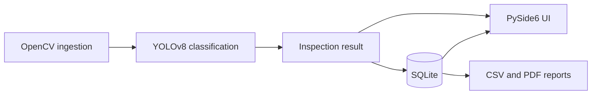

# Industrial Vision Inspector

Industrial Vision Inspector is a desktop quality-control project for classifying top-view casting images as defective or acceptable. The target dataset contains submersible pump impeller images captured from one product type and camera angle. Phase 1 establishes reproducible data preparation and OpenCV ingestion; model training, storage, the desktop UI, and reporting will be added in later verified phases.

Manual visual inspection can vary between operators and across a long shift. A small classification model can provide a consistent first-pass decision and preserve each result for review. This project is intentionally a demonstrator, not a claim of production-line readiness.

## Detection decision

The project uses a **classification-first** pipeline because the Kaggle dataset provides image-level `defective` and `ok_front` labels, not defect bounding boxes. YOLOv8 classification is faster and more reliable to train on modest hardware than a detector trained on noisy pseudo-boxes. Defective images will receive approximate OpenCV contour highlights for visual feedback; those highlights are not learned localization ground truth.

## Architecture



Only the ingestion and dataset-preparation components exist in Phase 1.

## Phase 1 setup

Use Python 3.11 or 3.12. From the repository root:

```bash
python -m venv .venv
source .venv/bin/activate
python -m pip install numpy opencv-python pytest kaggle
```

Dependency versions will be pinned during Phase 6, after the complete runtime dependency set is known.

### Kaggle credentials and dataset

1. Sign in to Kaggle and open **Settings**.
2. Under **API**, select **Create New Token** to download `kaggle.json`.
3. Move it to the Kaggle CLI location and restrict its permissions:

   ```bash
   mkdir -p ~/.kaggle
   mv /path/to/kaggle.json ~/.kaggle/kaggle.json
   chmod 600 ~/.kaggle/kaggle.json
   ```

4. Download, cache, and prepare the dataset:

   ```bash
   python scripts/download_dataset.py
   ```

The archive is cached under `data/cache/`, extracted under `data/raw/`, and split under `data/processed/casting_cls/`. All three locations are ignored by Git. A fixed seed creates a 70/15/15 per-class train, validation, and test split. Re-running the script uses completion manifests instead of downloading or copying again.

To prepare an existing local copy without contacting Kaggle:

```bash
python scripts/download_dataset.py --source-dir /path/to/extracted/dataset
```

## Verify ingestion

Run the tests:

```bash
pytest
```

Create a contact sheet from the checked-in fixtures:

```bash
python scripts/verify_ingestion.py
```

The script writes `reports/ingestion_samples.jpg`. Pass a folder path to inspect other images, or add `--show` when a graphical display is available. The module accepts a video path or webcam index through `iter_frames`; webcam index `0` selects the default camera.

## Current limitations

- No trained classifier exists yet, so Phase 1 does not make inspection decisions.
- Folder ingestion is intentionally non-recursive.
- Webcam behavior depends on local camera permissions and is not exercised in headless tests.
- The dataset supports one casting product and one camera viewpoint.

